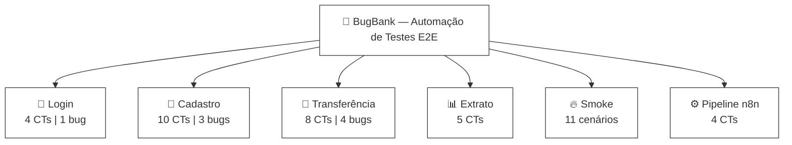

<div align="center">

       

  

# 🐞 BugBank — Automação de Testes E2E

Projeto de automação de testes end-to-end para a aplicação [BugBank](https://bugbank.netlify.app), cobrindo os principais fluxos com rastreabilidade por IDs de casos de teste, documentação de bugs e evidências, com foco em qualidade e boas práticas de QA.

</div>

---


## Arquitetura

```
cypress/
├── e2e/
│   ├── features/              # Cenários em Gherkin (.feature)
│   │   ├── cadastro/
│   │   ├── login/
│   │   ├── transferencia/
│   │   ├── extrato/
│   │   └── smoke/
│   └── step-definitions/      # Implementação dos steps por domínio
├── support/
│   ├── commands/              # Comandos customizados Cypress
│   ├── pages/                 # Page Objects (login, cadastro, transferência, extrato)
│   └── utils/                 # dataFactory — geração de dados com Faker
docs/
├── fuxograma/                 # Mapa visual dos testes (fluxograma.md)
├── bugs/                      # Bugs documentados (BUG-{MODULO}-{NUM}.md)
├── evidencias/                # Prints por módulo e CT
├── historico.csv              # Histórico de execuções via n8n
└── relatorios/                # Relatório HTML e messages.ndjson (gerado pelo Cucumber)
n8n-workflow.json              # Workflow importável do n8n
test-server.js                 # Servidor HTTP que executa os testes via n8n
docker-compose.yml             # Sobe o n8n localmente
```

---

## Como Executar

### Pré-requisitos

- Node.js instalado
- `npm install`

### Scripts disponíveis

```bash
# Abre a interface interativa do Cypress
npm run cy:open

# Executa todos os testes em modo headless
npm run cy:run

# Executa apenas cenários marcados com @run
npm run cy:focus

# Executa suíte de smoke
npm run cy:smoke

# Executa suíte de regressão
npm run cy:regression
```

---

## Módulos e Cobertura



### Casos de Teste

| Módulo | Total CTs | Passando ✅ | Com Bug 🐞 |
|---|---|---|---|
| Login | 4 | 3 | 1 |
| Cadastro | 10 | 7 | 3 |
| Transferência | 8 | 4 | 4 |
| Extrato | 5 | 5 | 0 |
| Pipeline n8n | 4 | 4 | 0 |
| **Total** | **31** | **23** | **8** |

---

## Tags BDD

| Tag | Uso |
|---|---|
| `@regression` | Suíte de regressão completa |
| `@smoke` | Cenários críticos de fumaça |
| `@bug` | Cenários que expõem bugs conhecidos |
| `@run` | Cenários focados para execução rápida |

---

## Pipeline n8n

Automação do disparo e monitoramento dos testes via [n8n](https://n8n.io).

**Pré-requisitos:** Docker Desktop + Node.js instalados.

### Subindo o ambiente

```bash
# 1. Sobe o n8n
docker-compose up

# 2. Em outro terminal, sobe o servidor de testes
node test-server.js
```

Acessa `http://localhost:5678` e importe o `n8n-workflow.json`.

### Disparo manual

```powershell
Invoke-WebRequest -Uri "http://localhost:5678/webhook/run-tests" -Method POST -ContentType "application/json" -Body '{"tags":"@smoke"}' -UseBasicParsing
```

### Fluxo

```
Webhook / Schedule Trigger (13h)
  → HTTP Request (test-server.js:3333)
  → Formatar Resultado
  → Send an Email (Gmail)
  → docs/historico.csv
```

### CTs do Pipeline

| ID | Descrição | Prioridade |
|---|---|---|
| CT-N8N-01 | Webhook dispara execução dos testes | 🔴 Alto |
| CT-N8N-02 | Schedule Trigger executa no horário configurado | 🔴 Alto |
| CT-N8N-03 | Email enviado com resultado correto após execução | 🟡 Médio |
| CT-N8N-04 | Histórico gravado em docs/historico.csv | 🟡 Médio |

---

## Bugs Documentados

Os bugs ficam em `docs/bugs/` no padrão `BUG-{MODULO}-{NUM}.md`.

| ID | Módulo | Descrição | Severidade |
|---|---|---|---|
| [BUG-LOGIN-01](docs/bugs/BUG-LOGIN-01.md) | Login | Mensagem de erro incorreta ao logar sem credenciais | Baixa |
| [BUG-CADASTRO-01](docs/bugs/BUG-CADASTRO-01.md) | Cadastro | Mensagem incorreta ao cadastrar sem e-mail | Alto |
| [BUG-CADASTRO-02](docs/bugs/BUG-CADASTRO-02.md) | Cadastro | Mensagem incorreta ao cadastrar sem senha | Alto |
| [BUG-CADASTRO-03](docs/bugs/BUG-CADASTRO-03.md) | Cadastro | Mensagem incorreta ao cadastrar sem confirmação de senha | Alto |
| [BUG-TRANSFER-01](docs/bugs/BUG-TRANSFER-01.md) | Transferência | Campo numérico não deve aceitar letras | Alto |
| [BUG-TRANSFER-02](docs/bugs/BUG-TRANSFER-02.md) | Transferência | Não redireciona para extrato após transferência | Baixo |
| [BUG-TRANSFER-03](docs/bugs/BUG-TRANSFER-03.md) | Transferência | Sistema permite transferência sem descrição | Médio |

---

## Relatórios

Ao executar `npm run cy:run`, os relatórios são gerados automaticamente em:

```
docs/relatorios/
├── report.html        # Relatório visual HTML
└── messages.ndjson    # Dados brutos dos cenários
```

---

## Padrões do Projeto

- **CTs:** `CT-{MODULO}-{NUM}` (ex: `CT-LOGIN-01`)
- **Bugs:** `BUG-{MODULO}-{NUM}` (ex: `BUG-CADASTRO-01`)
- **Evidências:** screenshots em `docs/evidencias/{modulo}/`
- **Fluxograma:** atualizado em [`docs/fuxograma/fluxograma.md`](docs/fuxograma/fluxograma.md)
