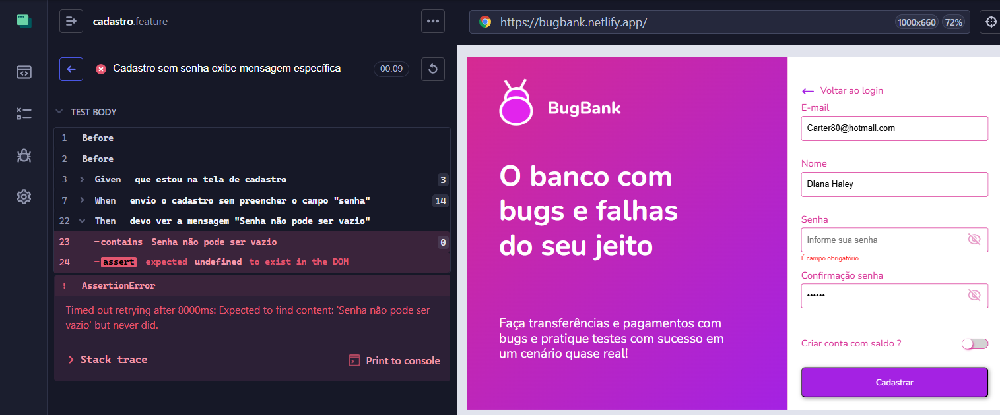

# 🐞 BUG-CADASTRO-02 — Mensagem incorreta ao cadastrar sem senha

## 📊 Detalhes
| Campo | Valor |
|------|------|
| **CT** | CT-CADASTRO-04 |
| **Severidade** | Média |
| **Prioridade** | Média |
| **Status** | Aberto |
| **Ambiente** | https://bugbank.netlify.app |
| **Data** | 2026-03-28 |

---

## 📌 Descrição
Ao tentar cadastrar sem preencher o campo **Senha**, o sistema não exibe a mensagem específica definida no requisito.

---

## 🔁 Passos
1. Acessar https://bugbank.netlify.app
2. Clicar em **Registrar**
3. Preencher todos os campos exceto **Senha**
4. Clicar em **Cadastrar**

---

## ✅ Esperado
`"Senha não pode ser vazio"`

## ❌ Obtido
`"É campo obrigatório"`

---

## 📸 Evidência

