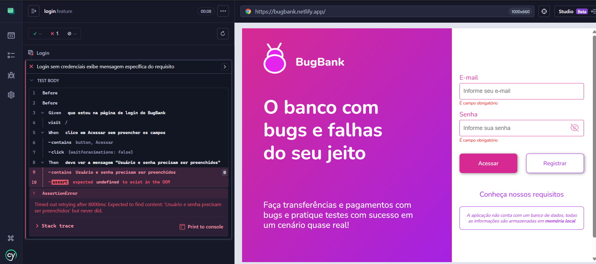

# 🐞 BUG-LOGIN-01 — Mensagem de erro incorreta no login sem credenciais

## 📊 Detalhes
| Campo | Valor |
|------|------|
| **CT** | CT-LOGIN-02 |
| **Severidade** | Baixa |
| **Prioridade** | Média |
| **Status** | Aberto |
| **Ambiente** | https://bugbank.netlify.app |
| **Data** | 2026-03-27 |

---

## 📌 Descrição
Ao clicar em **Acessar** sem preencher os campos, o sistema exibe mensagem genérica em vez da mensagem definida no requisito.

---

## 🔁 Passos
1. Acessar https://bugbank.netlify.app
2. Deixar os campos **E-mail** e **Senha** em branco
3. Clicar no botão **Acessar**

---

## ✅ Esperado
`"Usuário e senha precisam ser preenchidos"`

## ❌ Obtido
`"É campo obrigatório"`

---

## 📸 Evidência

