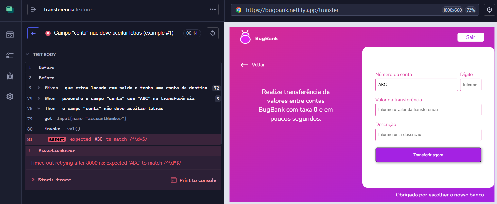
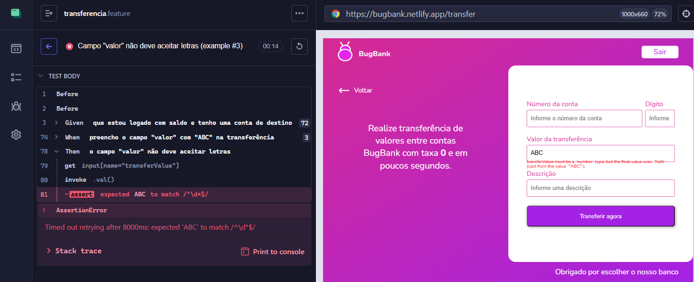

# 🐞 BUG-TRANSFER-01 — Campos numéricos aceitam letras e expõem mensagem técnica

## 📊 Detalhes
| Campo | Valor |
|------|------|
| **CT** | CT-TRANSFER-04 |
| **Severidade** | Alta |
| **Prioridade** | Alta |
| **Status** | Aberto |
| **Ambiente** | https://bugbank.netlify.app |
| **Data** | 2026-03-28 |

---

## 📌 Descrição
Os campos numéricos da tela de transferência aceitam texto não numérico e exibem mensagem de validação técnica interna ao usuário em vez de mensagem amigável.

Campos afetados:
| Campo | Valor inválido testado |
|-------|----------------------|
| Conta | ABC |
| Dígito | XYZ |
| Valor | ABC |

---

## 🔁 Passos
1. Acessar https://bugbank.netlify.app/transfer
2. Preencher um dos campos numéricos (Conta, Dígito ou Valor) com letras
3. Clicar em "Transferir agora"

---

## ✅ Esperado
Validação impede entrada não numérica e exibe mensagem amigável

## ❌ Obtido
Mensagem técnica exposta: `transferValue must be a number type, but the final value was NaN (cast from the value 'XYZ')`

---

## 📸 Evidência

**Campo: Conta**

**Campo: Dígito**

**Campo: Valor**

