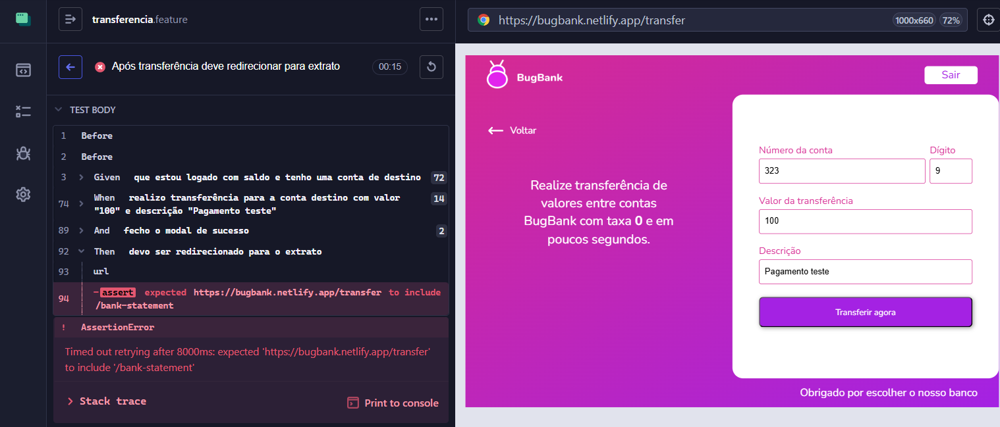

# 🐞 BUG-TRANSFER-02 — Sistema não redireciona para o extrato após transferência com sucesso

## 📊 Detalhes
| Campo | Valor |
|------|------|
| **CT** | CT-TRANSFER-08 |
| **Severidade** | Média |
| **Prioridade** | Média |
| **Status** | Aberto |
| **Ambiente** | https://bugbank.netlify.app |
| **Data** | 2026-03-28 |

---

## 📌 Descrição
Após fechar o modal de confirmação de uma transferência com sucesso, o sistema não redireciona o usuário para a tela de extrato.

---

## 🔁 Passos
1. Acessar https://bugbank.netlify.app
2. Realizar login com conta com saldo
3. Acessar a tela de transferência
4. Informar conta válida de outro usuário, valor e descrição
5. Clicar em **Transferir agora**
6. Fechar o modal de confirmação

---

## ✅ Esperado
O sistema deve redirecionar automaticamente para a tela de extrato após fechar o modal

## ❌ Obtido
O usuário permanece na tela de transferência após fechar o modal

---

## 📸 Evidência

