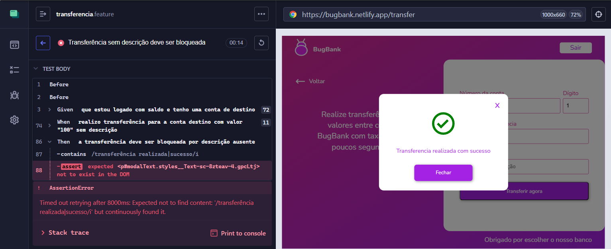

# 🐞 BUG-TRANSFER-03 — Sistema permite transferência sem descrição

## 📊 Detalhes
| Campo | Valor |
|------|------|
| **CT** | CT-TRANSFER-05 |
| **Severidade** | Média |
| **Prioridade** | Média |
| **Status** | Aberto |
| **Ambiente** | https://bugbank.netlify.app |
| **Data** | 2026-03-29 |

---

## 📌 Descrição
O campo Descrição da transferência é exibido como obrigatório, porém o sistema permite concluir a transferência sem que o campo seja preenchido, sem exibir nenhuma mensagem de erro.

---

## 🔁 Passos
1. Acessar https://bugbank.netlify.app
2. Realizar login com conta com saldo
3. Acessar a tela de transferência
4. Informar conta válida de outro usuário e valor
5. Deixar o campo Descrição em branco
6. Clicar em **Transferir agora**

---

## ✅ Esperado
O sistema deve bloquear a transferência e exibir mensagem de erro informando que a descrição é obrigatória

## ❌ Obtido
O sistema realiza a transferência normalmente sem exibir nenhuma mensagem de erro

---

## 📸 Evidência

